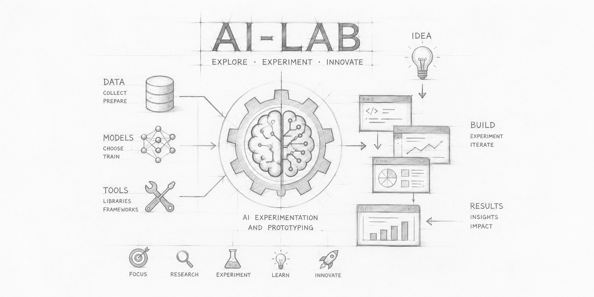

# AI-Lab

## Table of contents

- [Introduction](#introduction)
- [Technology Adoption Risk](./docs/notes/technology_adoption_risks.md)
- [Experiences and Outcomes](./docs/notes/experiences_and_outcomes.md)
   - [One Prompt Application Project](https://github.com/shortfastgood/one-prompt-apps)
- [AI and Tools](./docs/notes/ai_and_tools.md)
- [Engineering](./docs/notes/engineering.md)

## Introduction

Launched in 2023, when conversational AI reached a broad public audience, this project took shape. Interfaces built around chat, with ChatGPT at the forefront, reshaped the practical landscape of how people interact with artificial intelligence. The initial curiosity about conversational systems gradually crystallised into a systematic evaluation of development workflows augmented by AI, alongside a candid look at their engineering utility.

At its inception, this repository catalogued hands-on experience with GitHub Copilot and OpenAI's ChatGPT. Both services represented the earliest widespread embedding of AI into everyday routines; yet they simultaneously revealed a deep structural reliance on centrally hosted infrastructure, where gains arrive bundled with ongoing financial and operational burdens. As uptake broadened, the central inquiry shifted: no longer *whether* such tools proved helpful, but *whether* their pricing architecture could endure.

At the individual level, that burden typically surfaces as a gradual pile-up of subscription fees, throttled usage ceilings, and constrained influence over the very systems that mediate one's creative and technical labour. At the organisational scale, the identical dynamic multiplies into procurement entanglement, compliance mandates, unpredictable operating expenditure, and an escalating tether to outside platforms for processes that sit at the heart of internal operations. When AI becomes woven into daily practice, the economics of access carry as much weight as model quality itself.

Societal consequences, though harder to see, carry equal force. A cloud-first posture funnels capability, data, and decision-making authority into the hands of a handful of providers, while rendering routine the routing of working materials through infrastructures governed by distant entities. Under such conditions, issues of privacy, autonomy, and accountability fuse with questions of productivity and can no longer be separated from them.

It is against this backdrop that locally executed language models have grown markedly more pertinent. Once a specialist exercise demanding bespoke hardware, local inference now constitutes a viable path for an expanding range of real-world tasks—drafting, summarisation, code assistance, and structured analysis among them. Running models on-site does not eliminate trade-offs around latency, upkeep, or peak performance; nonetheless, it substantially reweights the equation connecting performance, governance, and cost.

Assessing local models, consequently, has ceased to be a matter of pure technical benchmarking. It functions as a strategic countermeasure against climbing usage expenses, tightening data-handling regulations, and the wider societal effects of sequestering AI capability behind remote services. For a great many applications, the pivotal question is not whether a locally hosted model outperforms the largest cloud-hosted alternatives, but whether it supplies adequate capability at a reduced financial, organisational, and societal price.

This repository operates on two levels simultaneously: as a chronological record of the shift described above, and as a working handbook for teams integrating AI-augmented workflows. It examines advantages, obstacles, and strategic dimensions, while offering concrete examples and pragmatic direction for embedding AI agents within development pipelines.

The inquiry has moved past *whether* AI will reshape software development. The live question now concerns the speed at which organisations can restructure themselves to harness these capabilities while containing the attendant risks. This repository chronicles that unfolding transformation.