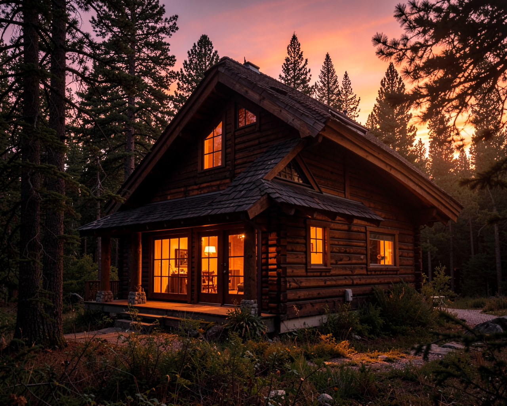
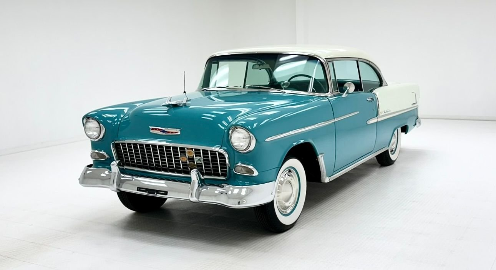
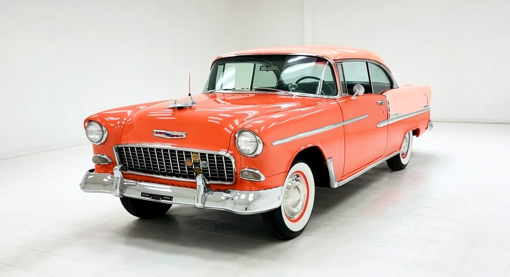

# MLXGen

[MLX-Gen](https://github.com/lpalbou/mlx-gen) is a local image and video generation runtime for Apple Silicon and MLX.

## Installation

**Pre-requirement**: The python interpreter must be already installed on the environment and a virtual python evironment already defined. See [Python Install Guide](../../ai-and-tools/plan-install-python3-guide.md)

    (.venv) user@macbook % pip install --upgrade mlx-gen

## Model Download

The tool defaults to Huggingface for model download, for large downloads and/or slow connections caffeinate ensures the download isn't interrupted

    (.venv) user@macbook % caffeinate -i mlxgen download --model Qwen/Qwen-Image-2512

## Quantization

If the model doesn't fit in the available memory may be quantized to reduce the size and/or to speed up the execution.

    % mlxgen prepare --model Qwen/Qwen-Image-Edit-2511\
                     --path ./model/qwen-image-edit-2511-mlx-4bit\
                     --quantize 4

## Models

|  | Publisher          | Model                | Quantized Model               | Quantization    | License    |
|--|--------------------|----------------------|-------------------------------|-----------------|------------|
| 1| Black Forrest Labs | FLUX.2-klein-4B      |                               |                 | Apache 2.0 |
| 2| Alibaba Qwen       | qwen-image-edit-2511 | qwen-image-edit-2511-mlx-4bit | variable 4/8bit | Apache 2.0 |

## Image Generation

This is merely an example to demonstrate the procedure; the model and parameters should be adapted to the specific case.

    (.venv) user@macbook % caffeinate -i mlxgen download --model black-forest-labs/FLUX.2-klein-4B

The number of steps depends on the model and its generative quality. The general rule is that more steps yield a better result; however, each step increases execution time and, beyond a certain point, the model is no longer able to improve the output.

    % mlxgen generate --model black-forest-labs/FLUX.2-klein-4B \
                      --prompt "A cozy cabin in the woods at sunset, warm light from windows, pine trees" \
                      --width 1280 \
                      --height 1024 \
                      --steps 4 \
                      --seed 42 \
                      --output ./test/tmp/cabin.png

- The model 1. is very fast: it generated the image below in 14 seconds on an M4 Max MacBook with 64GB of memory. The details are also very well defined with only a few steps (4).

## Image Edit

    % mlxgen generate --image ./test/data/image/1955-chevrolet-bel-air-2-door-hardtop.jpeg
                      --model black-forest-labs/FLUX.2-klein-4B \
                      --prompt "Replace the teal color of the car in the original picture with coral red" \
                      --steps 4 \
                      --seed 456 \
                      --task edit
                      --output ./test/tmp/coral-red-chewrolet-bel-air.png

- The model 1. is very fast: it generated the image below in 19 seconds on an M4 Max MacBook with 64GB of memory. The details are also very well defined with only a few steps (4).

original picture

modified picture
