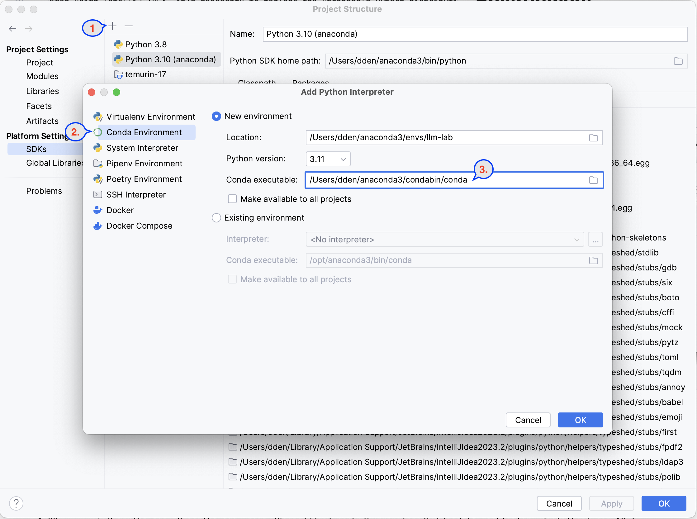

# Large Language Models' Lab

Some examples that explore the potential application fields of the LLM models.

## Environment

The programming environment consists of [Anaconda](https://www.anaconda.com/download) and an IDE; 
I use the paid version of [IntelliJ IDEA](https://www.jetbrains.com/idea/).

When using IntelliJ IDEA, it's necessary to declare the Anaconda's Python distribution as the interpreter for the project. 
Similarly, this must be done when using an alternative development environment.

In order to use jupyter notebooks Intellij will prompt you for the permission to install the jupyter pacages in to the conda environment.

### Libraries

The following instructions add to the conda environment the libraries required for this lab

    > pip install pdfminer.six transformers
    > pip install readability-lxml requests transformers
    > pip install accelerate
    > pip install langchain faiss-cpu sentence_transformers unstructured pdf2image

### Huggingface Cache

    > huggingface-cli scan-cache

## Document's Summarization

- [Notebooks](./doc/jupyter_notebooks.md)
  - [PDF Summarization](./doc/jupyter_notebooks.md#example-n1)
  - [WEB Page Summarization](./doc/jupyter_notebooks.md#example-n2)
- [Applications](./doc/applications.md)
  - [Multiple Source Summarizer](./doc/applications.md#example-a1)

### References

- [Hugging Face's Tranformers](https://huggingface.co/docs/transformers/index)
