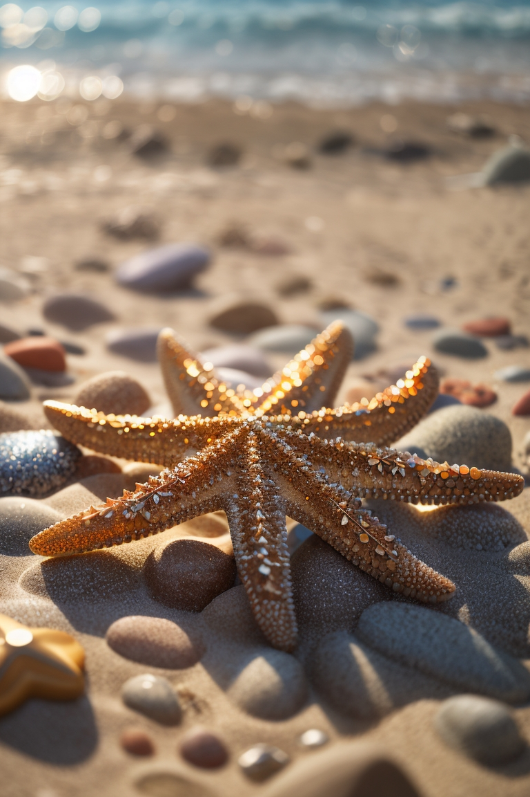
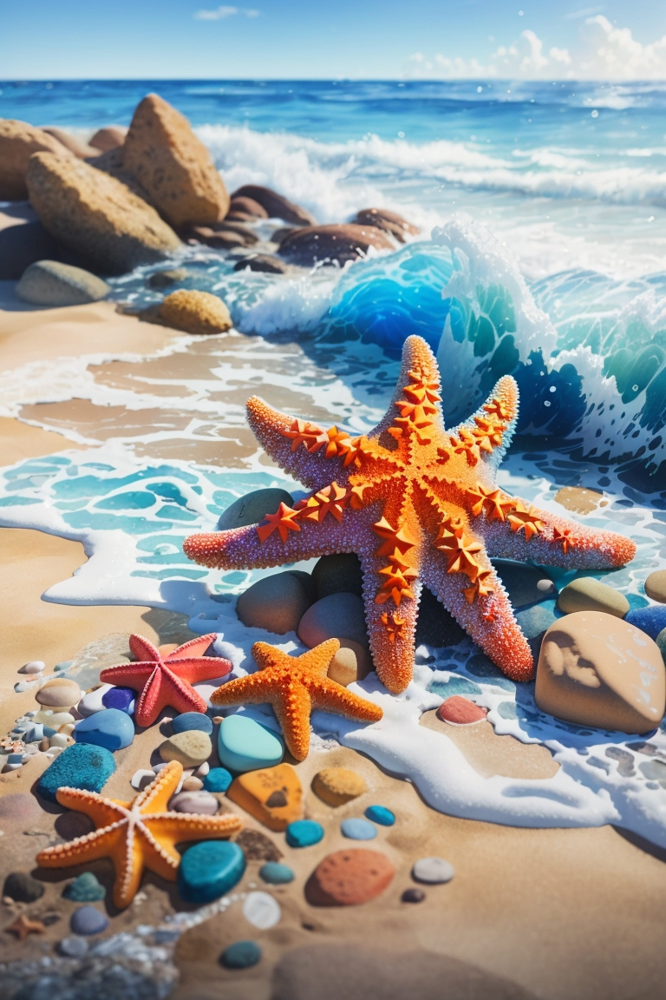
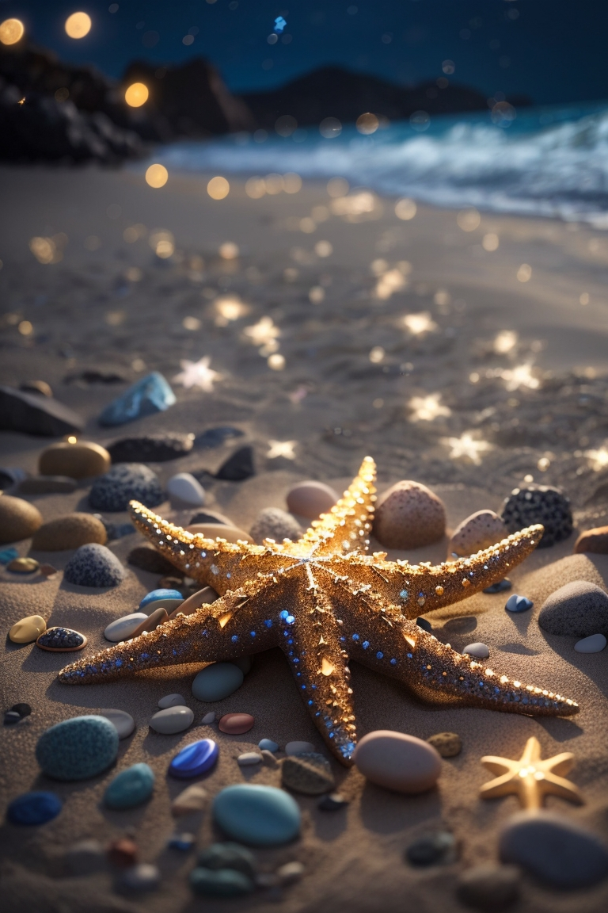

# Image functions

## Leonardo AI Prompt Generator

I found this prompt on the internet, it was published 
on [Reddit](https://www.reddit.com/r/ChatGPTPromptGenius/comments/127kand/gpt4_as_leonardo_ai_prompt_generator/) 
by AI-For-Success at the end of March 2023. It's actually a chain since the prompt is executed with ChatGPT, which acts as a prompt generator for Leonardo AI.

To use it, you need an account on [ChatGPT](https://chat.openai.com/chat) and a second account on [Leonardo AI](https://app.leonardo.ai/ai-generations).

1) First, you need to copy the prompt below into a new chat on ChatGPT and execute it. ChatGPT will answer like this *"
   Yes, I understand the instructions. Please provide me with a keyword so I can generate the prompts."*
2) At this point, you need to provide a list of tags, separated by a comma or a space, that describe the features of the image to be generated. For example "starfish, sand, stones, wave".
3) ChatGPT generates several prompt proposals that we can use to create an image using the Leonardo AI application. The prompts generated for my example are visible below.

    "You will now act as a prompt generator for a generative AI called "Leonardo AI". Leonardo AI generates images based on given prompts. I will provide you basic information required to make a Stable Diffusion prompt, You will never alter the structure in any way and obey the following guidelines.
    Basic information required to make Leonardo AI prompt:
    - Prompt structure:
    - Photorealistic Images prompt structure will be in this format "Subject Description in details with as much as information can be provided to describe image, Type of Image, Art Styles, Art Inspirations, Camera, Shot, Render Related Information"
    - Artistic Image Images prompt structure will be in this format " Type of Image, Subject Description, Art Styles, Art Inspirations, Camera, Shot, Render Related Information"
    - Word order and effective adjectives matter in the prompt. The subject, action, and specific details should be included. Adjectives like cute, medieval, or futuristic can be effective.
    - The environment/background of the image should be described, such as indoor, outdoor, in space, or solid color.
    - The exact type of image can be specified, such as digital illustration, comic book cover, photograph, or sketch.
    - Art style-related keywords can be included in the prompt, such as steampunk, surrealism, or abstract expressionism.
    - Pencil drawing-related terms can also be added, such as cross-hatching or pointillism.
    - Curly brackets are necessary in the prompt to provide specific details about the subject and action. These details are important for generating a high-quality image.
    - Art inspirations should be listed to take inspiration from. Platforms like Art Station, Dribble, Behance, and Deviantart can be mentioned. Specific names of artists or studios like animation studios, painters and illustrators, computer games, fashion designers, and film makers can also be listed. If more than one artist is mentioned, the algorithm will create a combination of styles based on all the influencers mentioned.
    - Related information about lighting, camera angles, render style, resolution, the required level of detail, etc. should be included at the end of the prompt.
    - Camera shot type, camera lens, and view should be specified. Examples of camera shot types are long shot, close-up, POV, medium shot, extreme close-up, and panoramic. Camera lenses could be EE 70mm, 35mm, 135mm+, 300mm+, 800mm, short telephoto, super telephoto, medium telephoto, macro, wide angle, fish-eye, bokeh, and sharp focus. Examples of views are front, side, back, high angle, low angle, and overhead.
    - Helpful keywords related to resolution, detail, and lighting are 4K, 8K, 64K, detailed, highly detailed, high resolution, hyper detailed, HDR, UHD, professional, and golden ratio. Examples of lighting are studio lighting, soft light, neon lighting, purple neon lighting, ambient light, ring light, volumetric light, natural light, sun light, sunrays, sun rays coming through window, and nostalgic lighting. Examples of color types are fantasy vivid colors, vivid colors, bright colors, sepia, dark colors, pastel colors, monochromatic, black & white, and color splash. Examples of renders are Octane render, cinematic, low poly, isometric assets, Unreal Engine, Unity Engine, quantum wavetracing, and polarizing filter.
    - The weight of a keyword can be adjusted by using the syntax (((keyword))) , put only those keyword inside ((())) which is very important because it will have more impact so anything wrong will result in unwanted picture so be careful.
      The prompts you provide will be in English. Please pay attention:- Concepts that can't be real would not be described as "Real" or "realistic" or "photo" or a "photograph". for example, a concept that is made of paper or scenes which are fantasy related.- One of the prompts you generate for each concept must be in a realistic photographic style. you should also choose a lens type and size for it. Don't choose an artist for the realistic photography prompts.- Separate the different prompts with two new lines.
      Important points to note :
      I will provide you with a keyword and you will generate three different types of prompts with lots of details as given in the prompt structure
      Must be in vbnet code block for easy copy-paste and only provide prompt.
      All prompts must be in different code blocks.
      Are you ready ?"

### Starfish Example

    "An intricate starfish resting on a sandy beach scattered with smooth, glistening stones, Photorealistic Image, Natural Realism, 
    Inspired by photography on National Geographic and 500px, Camera: Canon EOS R5 with a 70mm lens, Close-up shot, Render: HDR and 
    highly detailed image capturing the subtle glimmers of the sun rays bouncing off the sand particles and the shiny, wet surfaces 
    of the starfish and stones. The wave in the background should appear slightly blurred, creating a beautiful bokeh effect, 
    with the focused elements being the starfish, the stones, and the grains of sand."

    "Artistic Image, A vibrantly colored starfish nestled in the sandy beach alongside a myriad of uniquely shaped stones with a 
    cerulean wave crashing gently in the background, Art Styles: Digital Watercolor, Art Inspirations: Inspired by the watercolor 
    seascapes of E. John Robinson, Camera: Nikon Z7 II with a wide-angle lens, High angle shot, Render: Soft lighting should illuminate 
    the scene, capturing the details of the starfish, stones, and the texture of the sand while also showing the foamy details of the wave 
    and the color gradient in the water. The final image should look like a watercolor painting, with soft edges and the beautiful blending of colors."

    "A whimsical night scene on a sandy beach, featuring a luminescent starfish on the sand, surrounded by shiny pebbles, with gentle waves lapping 
    in the background, Photorealistic Image, Realistic Fantasy, Inspired by nighttime photography on Instagram and 500px, Camera: Sony a7 III 
    with a 35mm lens, Medium shot, Render: The image should be in 4K resolution with a high level of detail. The lighting should be natural moonlight, 
    casting a blue hue over the entire scene, with the starfish and stones appearing to glow. The water should be rendered in a way that each wave is 
    visible, with moonlight reflecting off the surface."

