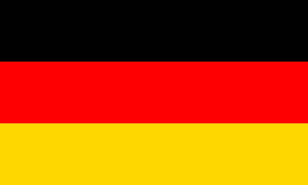
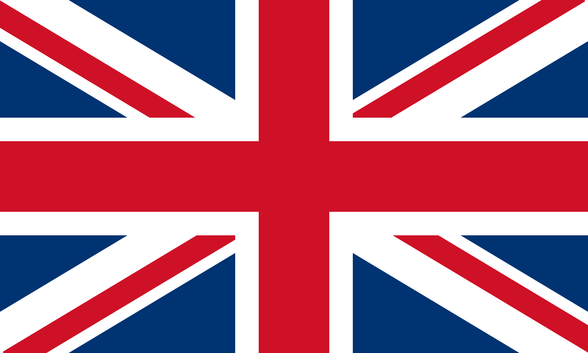
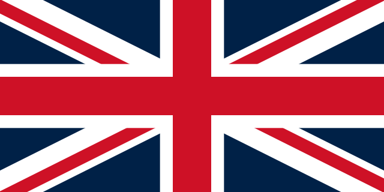

# Flags

## National Flags

### Germany

3:5 

**HUMAN**: *What are the correct proportions of the national flag of Germany?*

**CHAT**: *The national flag of Germany has proportions of 3:5. This means that the length of the flag is 1.67 times its height. The flag consists of three equal 
horizontal bands with the colors black, red, and gold from top to bottom.*

**HUMAN**: *Generate an SVG file containing a rectangle with a height of 360 and a width of 600, divided into three equal horizontal 
bands of black, red, and gold from top to bottom.*

**CHAT**:

    `<svg width="600" height="360">
        <rect width="600" height="120" y="0" fill="black" />
        <rect width="600" height="120" y="120" fill="red" />
        <rect width="600" height="120" y="240" fill="gold" />
    </svg>`

### Great Britain

 3:5  1:2 for Navy

**HUMAN**: *What are the correct proportions of the national flag of Great Britain?*

**CHAT**: *The national flag of Great Britain, also known as the Union Jack or Union Flag, has proportions of 1:2. This means that the length of the flag is 
twice its height. The Union Jack is a combination of the flags of England, Scotland, and Northern Ireland, and features the following elements: 
the Cross of St. George for England (red on a white background), the Cross of St. Patrick for Northern Ireland (red on a white background, diagonally), 
and the Cross of St. Andrew for Scotland (white on a blue background, diagonally).*

The Union Jack is more complex and requires the human operator to develop a proper learning program for the CHAT.
Each step must be checked because the CHAT makes errors in evaluating the text and also in the calculations.
Thus, the human operator has to step in and make the appropriate corrections.

#### Draw the rectangle

**HUMAN**: Generate an SVG code that draws a blue rectangle 1200x720, with the color being RGB 003371. Please add the namespace declaration.

**CHAT**:

    `<svg xmlns="http://www.w3.org/2000/svg" width="1200" height="720">
       <rect x="0" y="0" width="1200" height="720" fill="#003371" />
     </svg>`

#### Draw the St. Andrews Cross

**HUMAN**: Using the previously generated code: add a white line that goes from the top left vertex to the bottom right vertex. The line has a width of 1/5 the height of the rectangle. Also, add a white line that goes from the bottom left vertex to the top right vertex. The line has a width of 1/5 the height of the rectangle.

**CHAT**:

    `<svg xmlns="http://www.w3.org/2000/svg" width="1200" height="720">
       <rect x="0" y="0" width="1200" height="720" fill="#003371" />
       <line x1="0" y1="0" x2="1200" y2="720" stroke="#FFFFFF" stroke-width="144" />
       <line x1="0" y1="720" x2="1200" y2="0" stroke="#FFFFFF" stroke-width="144" />
     </svg>`

#### Draw the St. Patrick's Cross

**HUMAN**: Using the previously generated code, add a line, at the end, from the top left vertex to the middle. The line has a width of 1/15 of the height of the rectangle. Translate the line 1/40 of the height of the rectangle to the left and 1/40 of the height of the rectangle to the bottom. The line color is #CE1126.
**CHAT**:

    `<svg xmlns="http://www.w3.org/2000/svg" width="1200" height="720">
       <rect x="0" y="0" width="1200" height="720" fill="#003371" />
       <line x1="0" y1="0" x2="1200" y2="720" stroke="#FFFFFF" stroke-width="144" />
       <line x1="0" y1="720" x2="1200" y2="0" stroke="#FFFFFF" stroke-width="144" />
       <line x1="0" y1="0" x2="600" y2="360" stroke="#CE1126" stroke-width="48" transform="translate(-30, 18)" />
     </svg>`

**HUMAN**: Using the previously generated code, add a line, at the end, from middle of the rectangle to the bottom right vertex. The line has a width of 1/15 of the height of the rectangle. Translate the line 1/40 of the height of the rectangle to the right and 1/40 of the height of the rectangle to the top. The line color is #CE1126.
**CHAT**:

    `<svg xmlns="http://www.w3.org/2000/svg" width="1200" height="720">
       <rect x="0" y="0" width="1200" height="720" fill="#003371" />
       <line x1="0" y1="0" x2="1200" y2="720" stroke="#FFFFFF" stroke-width="144" />
       <line x1="0" y1="720" x2="1200" y2="0" stroke="#FFFFFF" stroke-width="144" />
       <line x1="0" y1="0" x2="600" y2="360" stroke="#CE1126" stroke-width="48" transform="translate(-18, 18)" />
       <line x1="600" y1="360" x2="1200" y2="720" stroke="#CE1126" stroke-width="48" transform="translate(18, -18)" />
     </svg>`

**HUMAN**: Using the previously generated code, add a line, at the end, from the bottom left vertex to the middle. The line has a width of 1/15 of the height of the rectangle. Translate the line 1/40 of the height of the rectangle to the right and 1/40 of the height of the rectangle to the bottom. The line color is #CE1126.
**CHAT**:

    `<svg xmlns="http://www.w3.org/2000/svg" width="1200" height="720">
       <rect x="0" y="0" width="1200" height="720" fill="#003371" />
       <line x1="0" y1="0" x2="1200" y2="720" stroke="#FFFFFF" stroke-width="144" />
       <line x1="0" y1="720" x2="1200" y2="0" stroke="#FFFFFF" stroke-width="144" />
       <line x1="0" y1="0" x2="600" y2="360" stroke="#CE1126" stroke-width="48" transform="translate(-18, 18)" />
       <line x1="600" y1="360" x2="1200" y2="720" stroke="#CE1126" stroke-width="48" transform="translate(18, -18)" />
       <line x1="0" y1="720" x2="600" y2="360" stroke="#CE1126" stroke-width="48" transform="translate(18, 18)" />
     </svg>`

**HUMAN**: Using the previously generated code, add a line, at the end, from middle of the rectangle to the top right vertex. The line has a width of 1/15 of the height of the rectangle. Translate the line 1/40 of the height of the rectangle to the left and 1/40 of the height of the rectangle to the top. The line color is #CE1126.
**CHAT**:

    `<svg xmlns="http://www.w3.org/2000/svg" width="1200" height="720">
       <rect x="0" y="0" width="1200" height="720" fill="#003371" />
       <line x1="0" y1="0" x2="1200" y2="720" stroke="#FFFFFF" stroke-width="144" />
       <line x1="0" y1="720" x2="1200" y2="0" stroke="#FFFFFF" stroke-width="144" />
       <line x1="0" y1="0" x2="600" y2="360" stroke="#CE1126" stroke-width="48" transform="translate(-18, 18)" />
       <line x1="600" y1="360" x2="1200" y2="720" stroke="#CE1126" stroke-width="48" transform="translate(18, -18)" />
       <line x1="0" y1="720" x2="600" y2="360" stroke="#CE1126" stroke-width="48" transform="translate(18, 18)" />
       <line x1="600" y1="360" x2="1200" y2="0" stroke="#CE1126" stroke-width="48" transform="translate(-18, -18)" />
     </svg>`

#### Draw the St. George's Cross

**HUMAN**:Using the previous generated code: add a new line at the end that divide the rectangle horizontally in two equal parts, the line is white and the width of the line is 1/3 of the rectangle height.

**CHAT**:

    `<svg xmlns="http://www.w3.org/2000/svg" width="1200" height="720">
       <rect x="0" y="0" width="1200" height="720" fill="#003371" />
       <line x1="0" y1="0" x2="1200" y2="720" stroke="#FFFFFF" stroke-width="144" />
       <line x1="0" y1="720" x2="1200" y2="0" stroke="#FFFFFF" stroke-width="144" />
       <line x1="0" y1="0" x2="600" y2="360" stroke="#CE1126" stroke-width="48" transform="translate(-18, 18)" />
       <line x1="600" y1="360" x2="1200" y2="720" stroke="#CE1126" stroke-width="48" transform="translate(18, -18)" />
       <line x1="0" y1="720" x2="600" y2="360" stroke="#CE1126" stroke-width="48" transform="translate(18, 18)" />
       <line x1="600" y1="360" x2="1200" y2="0" stroke="#CE1126" stroke-width="48" transform="translate(-18, -18)" />
       <line x1="0" y1="360" x2="1200" y2="360" stroke="#FFFFFF" stroke-width="240" />
     </svg>`